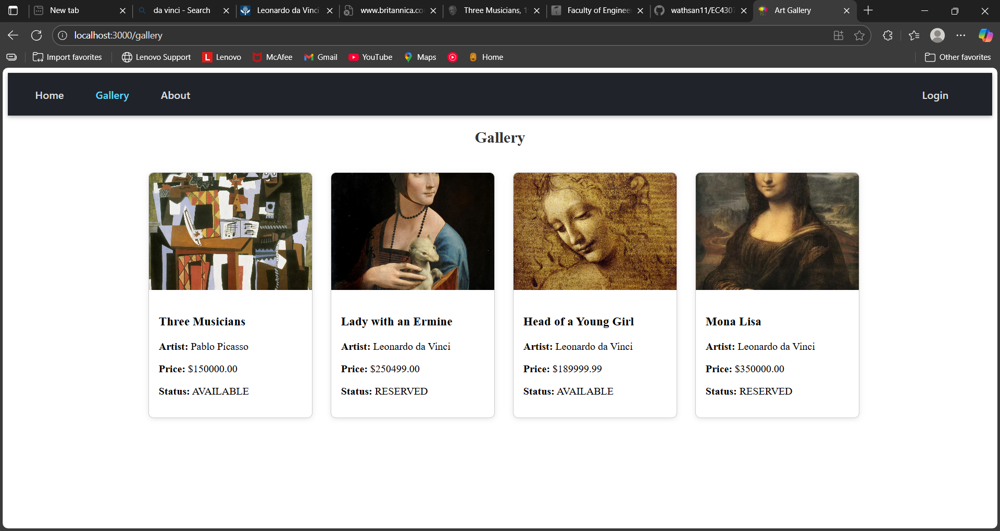

# EC4307-Web-Development-Project-Sem4

## Siththam Art Gallery

A web application showcasing beautiful artworks by local artists. This platform allows artists to register, log in, and upload their paintings, while visitors can browse the gallery

### Table of Contents

- Features
- Demo
- Tech Stack
- Installation
- Usage
- API Endpoints
- Folder Structure
- License

### Features

- Artist registration and login
- Secure artist authentication
- Upload and manage paintings (title, image, price)
- Browse artworks in a responsive galler
- User-friendly interface with React
- Backend built with Spring Boot and MySQL
- Error handling and loading states

### Demo



### Tech Stack

- Frontend: React.js, Axios, React Router
- Backend: Spring Boot, Java
- Database: MySQL
- Others: ESLint for code quality, Maven for build

### Installation

#### Prerequisites

- Node.js and npm installed
- Java JDK installed
- MySQL server running

#### Steps

1. Clone the repo:
```bash
git clone https://github.com/yourusername/siththam-art-gallery.git
cd siththam-art-gallery
```
2. Setup backend:
- Navigate to backend folder and configure database connection in application.properties.
- Run the Spring Boot application:
```bash
./mvnw spring-boot:run
```

3. Setup frontend:
- Navigate to frontend folder:
```bash
cd siththam-frontend
```

- Install dependencies:
```bash
npm install
```

- Start React app:
```bash
npm start
```

### Usage

- Open the React app in your browser (http://localhost:3000).
- Register as an artist or log in.
- Upload paintings to showcase your artwork.
- Browse the gallery and view artworks.

### API Endpoints

(Briefly list main backend endpoints, e.g.)
- POST /artists/addArtist — Register artist
- POST /artists/login — Artist login
- GET /api/paintings/getAll — Get all paintings
- POST /api/paintings/upload — Upload new painting

### Folder Structure
```
siththam-art-gallery/
├── backend/
│   ├── src/main/java/com/atrsite/siththam/
│   └── resources/
├── siththam-frontend/
│   ├── public/
│   ├── src/
│       ├── components/
│       ├── pages/
│       └── App.js
└── README.md
```

### License

This project is licensed under the MIT License.


